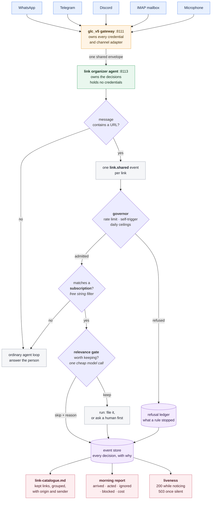

# S16Code — a general live-graph agent

> **Running the Session 16 Part 1 executive assistant?** Start-up order, reset steps and per-channel verification are in [RUNBOOK.md](RUNBOOK.md).

S16Code takes S15's durable graph, memory, A2A, UI, budget controller and
telemetry as its foundation, then replaces the task-shaped planner with a
general capability-driven agent loop. `glc_v5` connects that loop to every
enabled gateway channel through one shared envelope.

The planner does **not** build the whole DAG up front. It proposes only the next
runnable frontier, the runtime launches independent nodes together, and every
outcome causes another planning round. The graph therefore grows from evidence:

```text
goal → plan next frontier → run independent work concurrently
     → observe real outcomes → critique evidence → expand or answer
```

There is no prompt classifier, benchmark router, `_work_intent`, or deterministic
task fallback. A model may propose work, but Python owns the boundary: only
registered capabilities with valid arguments and valid existing dependencies
can enter the graph.

## What makes it general

- `s16code/capabilities.py` is the complete manifest the planner sees. It
  describes what the agent can do and strictly validates every argument.
- `s16code/planner.py` asks for only the next useful frontier. A new task may
  depend only on evidence that already exists—not on an imagined future task.
- Independent tasks in one frontier run concurrently. Synthesis is held until
  active siblings finish, so the agent does not answer while useful evidence is
  still arriving.
- Before a terminal answer, a separate evidence-readiness pass checks the
  original request against accumulated outcomes. Missing facts cause more work,
  not cosmetic rewriting.
- Equivalent active work is deduplicated even when the planner invents a new
  node ID. Run and frontier limits keep an unproductive loop finite.
- Invalid planner output is repaired through the model and recorded. If repair
  fails, the run fails visibly; it never switches to a hidden, hardcoded agent.

## Capabilities

The shipped registry includes scoped memory recall and explicit remembering,
semantic document indexing, web search and URL reading, bounded research,
retrieval/distillation/validation, sandboxed file access, calendar artifact
creation, A2A delegation, UI composition and evidence-grounded answers.

Web research uses a multi-backend search client and then reads the returned
pages. Search snippets and pages are untrusted evidence. Crucially, if search
finds no usable URL—or no page can be read—the researcher returns
`insufficient: true` and does **not** ask a model to synthesize facts.

## Unattended operation

Everything above assumes somebody asked. The autonomy layer is what the harness
adds for the case where nobody did, and where nobody is watching either.

- `s16code/events/` normalises cron ticks, webhooks, Gmail Pub/Sub, channel
  messages and job callbacks into one `EventEnvelope`, deduplicates on
  `(source, id)`, and records a relevance decision for every matching
  subscription — including the decisions that were "no".
- **Events are facts; subscriptions are intent and authority.** An event can
  never write the instruction, the allowed side effects or the budget that
  govern it. That is why writing a subscription is a control-plane action.
- `s16code/auth.py` gates every write path and **fails closed**. With no
  `S16_CONTROL_TOKEN` configured, `PUT /v1/agent/subscriptions/{id}`,
  `POST /v1/agent/events`, `POST /v1/agent/runs` and the resume route all answer
  `503` rather than serving anonymously. Job callbacks hold a separate token.
- `s16code/events/governor.py` bounds operation over a **window**, not a
  request. A per-run ceiling does not bound an agent that starts its own runs;
  `daily_budget`, `max_runs_per_day` and `daily_triage_budget` do. It also
  rate-limits per source and refuses events this agent itself caused, so a reply
  into a watched mailbox cannot become a loop.
- A subscription also names a `provider`. That is a ceiling on **disclosure**
  rather than spend: it says which model this subscription's events may reach at
  all, and it is applied to the relevance gate as well as the run
  (`s16code/events/engine.py:86-99`), because a gate that read the event has
  already disclosed it.
- Every refusal is recorded and served at `GET /v1/agent/refusals?hours=N`. A
  control that prevents work leaves no other trace, and without the record a
  well-defended night and an idle night look identical.
- `s16code/events/lease.py` stops a periodic trigger overlapping itself, and
  reports a skip rather than silently doing nothing.
- `s16code/events/report.py` publishes a heartbeat (`GET /v1/agent/liveness`,
  `503` once stale) and the human-readable account of a period nobody watched
  (`GET /v1/agent/report`), which costs **watching** separately from **doing**.
- `GET /console` is the operator page: a read-only projection of the durable
  history — liveness beat, live event tape, refusals, subscriptions and the
  rendered report. It has no write control by design. An operator page that could
  grant authority would be the exact hole the control plane exists to close.

```bash
uv run python proofs/p_naive_vs_bounded.py    # naive vs gated vs bounded, same stream
uv run python proofs/p_autonomy_bounds.py     # seven properties of the ceilings
```

Both take their event stream and every ceiling as arguments, so they run against
work they have never seen, and both exit non-zero on failure.

## The assistant running on it

Everything above is machinery. The Session 16 Part 1 build is the assistant that
uses it: it watches five real channels — **WhatsApp, Telegram, Discord, IMAP and
a local microphone** — and does one job. Decide which shared links are worth
keeping, file those, and say why it dropped the rest. Start-up order, reset and
per-channel verification are in [RUNBOOK.md](RUNBOOK.md).



Two properties of that picture matter more than the boxes. **Authority flows only
from the subscription**, never from an arriving message — nothing a sender writes
can widen what the agent may do. And **every "no" lands in the store**: a link the
gate skipped carries its reason, and work a ceiling prevented is recorded in the
refusal ledger, because refused work leaves no other trace — nothing spent, nothing
logged, nothing to find later.

[docs/example-link-catalogue.md](docs/example-link-catalogue.md) shows what the
rendered catalogue looks like after the assistant has been running across several
groups for a few months — 31 links kept, 174 refused with a reason each. The
ratio is the point: the value is in what it left out.

A message is not the unit of work. `POST /v1/agent/channel-messages` extracts
every URL and derives one `link.shared` event per link (`s16code/routes.py:344`),
so three links in one message become three independently judged decisions and one
reply. A URL already filed is reported as a duplicate rather than filed twice,
and a link no subscription claims falls through to the ordinary agent loop
instead of being dropped in silence. The reply names what was refused and by
which control, because an assistant that quietly discards a link is
indistinguishable from one that never saw it.

`tools/put_subscriptions.py` installs the two subscriptions that grant all of
this authority. Two rather than one, because authority is scoped per subscription
and the two halves are not governed alike:

|  | `links-private` | `links-public` |
|---|---|---|
| sources | `local_mic:*` | `discord:*`, `imap:*`, `whatsapp:*`, `telegram:*` |
| may do | `request_approval`, `write_file` | `request_approval`, `write_file` |
| ceilings | 40 runs/day, $0.05/day triage | $0.02/run, $0.50/day, 60 runs/day, $0.10/day triage |

The private tier carries no dollar ceiling on purpose. It is the tier meant for a
local model, where a dollar ceiling projects $0.00 and decorates instead of
binding, so the run count and the per-source rate limit are what actually hold.
Both shipped subscriptions currently pin `provider: gemini`: on this machine
qwen2.5:7b judges well — its verdicts quote the instruction correctly — but it
emits planner patches with invented fields, so the judgement is sound while every
run fails validation. The disclosure ceiling is enforced either way; only the
value differs, and the file says so rather than implying a local tier that is not
running.

The instruction is the policy, and it chooses between exactly two shapes: file
the link, or — when the sender explicitly asks the owner to decide —
`request_approval` and wait. The second is what exercises wait/resume: a reply in
the same thread satisfies the parked approval node and the original run finishes
under its original `run_id`.

The catalogue is rendered, not written by a model:

```bash
uv run python tools/render_catalog.py               # write sandbox/link-catalogue.md
uv run python tools/render_catalog.py --watch 30    # keep it current during a demo
uv run python tools/render_catalog.py --hours 24    # window it by event time
```

The agent could be told to maintain that markdown itself, and it would — grouping,
ordering and phrasing drifting on every run. So the judgement stays the model's
(filed or skipped, and why) and the presentation stays deterministic: the
renderer reads the recorded decisions and rewrites the document from them. Same
data, same bytes. It reads only — it cannot file, unfile or re-judge anything.
The **Skipped** section is the point rather than an appendix; it is the evidence
that the agent is judging rather than hoarding.

What an operator actually looks at:

```bash
curl -s "http://127.0.0.1:8113/v1/agent/events?after=0"
curl -s "http://127.0.0.1:8113/v1/agent/refusals?hours=1"
curl -s "http://127.0.0.1:8113/v1/agent/report?hours=1&fmt=markdown"
# and http://127.0.0.1:8113/console for the same facts as a page
```

## Inherited production boundaries

- `s16code/core/live_graph/`: event-sourced executor, patches and replay
- `s16code/core/memory/`: typed, scoped memory and semantic chunking
- `s16code/core/a2a/`: Agent Cards, JSON-RPC and optional gRPC
- `s16code/ui/`: catalog validation, A2UI surfaces, AG-UI and HITL
- `s16code/economics/`: model tiers, hard budget admission and ledger
- `s16code/telemetry/`: journal-to-OpenTelemetry span export
- `s16code/evals/`: generic resolution judging

The graph journal remains the source for replay, UI events and telemetry. All
gateway model calls—including planning and evidence review—pass through S15's
metered call seam. `glc_v5` remains a separate service and owns provider keys;
S16Code contains none.

## Run locally

Start `glc_v5` on port `8111`, then:

```bash
uv sync
cp .env.example .env
uv run pytest -q
uv run ruff check .
uv run s16code serve
```

S16Code defaults to `http://127.0.0.1:8113`. Useful environment variables are
documented in `.env.example`; most importantly:

```text
GLC_BASE_URL=http://127.0.0.1:8111
S16_GATEWAY_PROVIDER=gemini
S16_SANDBOX_ROOT=/absolute/path/the-agent-may-read
S16_CHANNEL_BRIDGE_TOKEN=the-same-private-value-used-by-glc-v5
S16_CONTROL_TOKEN=required-or-every-write-path-answers-503
S16_COMPLETION_TOKEN=a-different-token-for-job-callbacks
```

The control plane has no unauthenticated mode. `if expected and not
compare_digest(...)` reads like a check and behaves like an open door on a fresh
checkout, so these gates refuse to serve instead.

Do not put provider keys in S16Code. `glc_v5` can rotate among its configured
Gemini keys behind the one logical `gemini` provider.

## Channel operation and proof

GLC converts provider-specific payloads; S16 sees only the canonical envelope.
An inbound message creates a real live-graph run, and its terminal result is
returned on the originating channel and thread. A same-thread reply can satisfy
a waiting human-approval node. An external job callback can resume a sleeping
run and proactively send its completed answer through GLC.

The channel list is discovered from GLC at runtime:

```bash
curl -s http://127.0.0.1:8111/v1/channels | jq
```

The 20-prompt stress catalogue spans every shipped channel and checks observable
capability families, parallel frontiers, and wait/resume events—not prescribed
node IDs or a prompt-specific graph:

```bash
# Start this proof S16 with only local fixture mutations authorised:
S16_CHANNEL_ALLOWED_SIDE_EFFECTS=remember_explicit_fact,write_file,index_file,create_calendar_events,request_approval \
  uv run s16code serve

# In another shell, use the installation token printed from glc_v5:
GLC_INSTALL_TOKEN=<glc-v5-install-token> \
  uv run python proofs/channel_stress.py \
  --glc http://127.0.0.1:8111 --s16 http://127.0.0.1:8113
```

Run the proof with channel authority limited to the local fixture capabilities
shown in `proofs/channel_stress.py`. It injects canonical envelopes locally and
fails any scenario that invokes `send_channel_message` or `launch_job`, so it
cannot silently count an external delivery as proof.
Native provider payload conversion remains the responsibility of each GLC
adapter's tests. Its JSON report contains each original prompt, actual graph
capabilities, reply, event count, parallel/wait/resume evidence, and result.

GLC recomputes sender trust from pairing state before the message reaches S16.
Only a gateway-verified installation owner receives the side-effect authority
listed in `S16_CHANNEL_ALLOWED_SIDE_EFFECTS`; other allowed senders remain
read-only.

Example:

```bash
curl -s http://127.0.0.1:8113/v1/agent/runs \
  -H 'content-type: application/json' \
  -d '{
    "tenant_id":"demo",
    "project_id":"general-agent",
    "user_id":"student",
    "prompt":"Research Rust and Go independently, then compare their concurrency models. Explain one situation where each is the safer choice."
  }' | jq '{status, answer, graph: .graph.nodes, planner: .trace.planner}'
```

## Replaceable live proof

`proofs/tasks/general_agent.jsonl` is data, not routing code. Replace its prompts
with unseen tasks and run the same HTTP harness against a live S16 process:

```bash
S16_PORT=8116 uv run s16code serve
uv run python proofs/general_agent_live.py \
  --base-url http://127.0.0.1:8116 \
  --tasks proofs/tasks/general_agent.jsonl
```

The output at `proofs/out/general_agent_live.json` retains each prompt, final
answer, every node and edge, every accepted graph patch, planner decisions,
evidence review and timing. This is the inspectable proof of behavior—not a
claim that a prompt "worked."

The inherited S15 economics proofs remain available in `proofs/`. They test the
same runtime's budget ceiling, denial-of-wallet protection, trace export,
semantic-cache savings and cross-model tier ladder.

## Honest limits

A general agent is bounded by its registered capabilities, source availability
and models. The evidence critic is an additional model judgment, not a theorem.
The hard guarantees are narrower and enforced in code: authority validation,
existing-evidence dependencies, bounded graph/frontier size, deduplication,
metered provider calls, budget admission, durable outcomes, and no research
synthesis without readable sources.

The morning report separates the two bills deliberately, and only one of them is
currently real. `cost_of_watching_usd` is summed from the per-decision triage
cost recorded at the gate. `cost_of_doing_usd` is whatever a run reports as
`spend_usd` (`s16code/events/engine.py:163-164`), and this build's runtime
reports none, so it reads `$0.00`. The authoritative money record is the
gateway's own ledger, `GET /v1/cost/by_principal` on glc_v5.

Liveness is event-driven in the same literal way: `store.beat()` is called in one
place, on arrival (`s16code/events/engine.py:70`). There is no startup beat and
no timer, so a `503` means *silence* — a running process that has heard nothing
for `STALE_AFTER_SECONDS`. A killed process refuses the connection instead, which
is a different signal and a cruder one.

Provider adapters vary in how much live external delivery they implement. The
connection proof establishes that every registered adapter reaches the S16 seam;
it is not a claim that unconfigured Gmail, Twilio, or Slack accounts can send.
